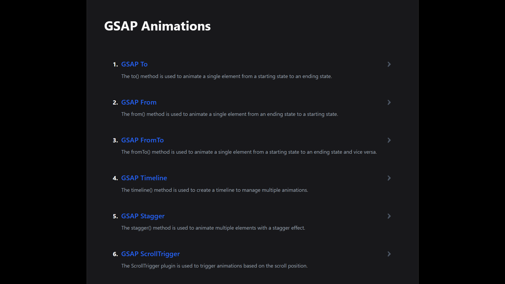

<div align="center">
    <a href="https://gsap-crash-course.vercel.app" target="_blank">
      
    </a>
  <h3 align="center">GSAP Workshop (Starter)</h3>
</div>

##  <br /> 📋 <a name="table">Table of Contents</a>

- ✨ [Introduction](#introduction)
- ⚙️ [Tech Stack](#tech-stack)
- 🚀 [Quick Start](#quick-start)

##  <br /> <a name="introduction">✨ Introduction</a>

Simple GSAP workshop showcasing various primary animations. GSAP (GreenSock Animation Platform) is a framework-agnostic JavaScript animation library used to create fluid and engaging animations.

##  <br /> <a name="tech-stack">⚙️ Tech Stack</a>

- [**React**](https://react.dev/reference/react) is a popular JavaScript library for building user interfaces, particularly single-page applications where data changes over time. React's component-based architecture allows developers to create reusable UI components, making development more efficient and the codebase easier to maintain.

- [**GSAP**](https://gsap.com/resources/) (GreenSock Animation Platform) is a powerful JavaScript library for creating high-performance animations. It excels in animating HTML elements with smoothness and precision, making it ideal for enhancing user interfaces and web experiences. GSAP's robust API allows developers to create complex animations easily, leveraging timelines and plugins for advanced control and customization. Its efficient rendering engine ensures animations run smoothly across different browsers and devices, providing a seamless user experience.

- [**Vite**](https://vitejs.dev/guide/) is a modern frontend build tool known for fast ES Module imports, efficient bundling, and quick development server startup times. It supports frameworks like Vue.js and React, optimizing workflow and performance compared to traditional bundlers.

## <br /> <a name="quick-start">🚀 Quick Start</a>

Follow these steps to set up the project locally on your machine.

<br/>**Prerequisites**

Make sure you have the following installed on your machine:

- [Git](https://git-scm.com/)
- [Node.js](https://nodejs.org/en)
- [npm](https://www.npmjs.com/) (Node Package Manager)

<br/>**Cloning the Repository**

```bash
git clone https://github.com/ks-official-sahan/learn-gsap.git
cd gsap-cc-starter
```

<br/>**Installation**

Let's install the project dependencies, from your terminal, run:

```bash
npm install
```

<br/>**Running the Project**

Installation will take a minute or two, but once that's done, you should be able to run the following command:

```bash
npm run dev
```

Open [`http://localhost:5173`](http://localhost:5173) in your browser to view the project.

<br/>
---

# 🛡️ Supreme Project Repository

Welcome to a project maintained, owned, or created under the exclusive rights of  
**Subasin Arachchige Sahan Sachintha** — CEO, Architect, and Supreme Owner of all source code, designs, IP, and revenue streams contained herein.

---

## 📦 Overview

This repository includes components, modules, or systems intended for internal, client, or commercial use.  
All assets are subject to **Supreme Proprietary License v1.0**, which **does not permit free usage** unless explicitly granted.

---

## 👑 Ownership & License

- **© 2025 Subasin Arachchige Sahan Sachintha**
- **License:** [SUPREME_LICENSE.md](./SUPREME_LICENSE.md)
- **Protected by:** International IP, Cybersecurity, and Cybercrime laws
- **Jurisdiction:** Colombo, Sri Lanka

---

## 🚫 Usage Restrictions

- ❌ Redistribution without explicit permission is forbidden
- ❌ Unauthorized modification is a violation of the license
- ❌ Any monetization must include a **minimum 10% royalty or commission**

For legal use, licensing, or partnership inquiries, contact:

> 📧 **<ks.official.sahan@gmail.com>**  
> 📱 **+94 768 701148**

---

## 💼 Business & Legal Attribution

- **Entity Name:** Evision IT (PVT) Ltd
- **License Version:** Supreme Proprietary License v1.0
- **Contact:** [GitHub Profile](https://github.com/ks-official-Sahan)

---

## ⚖️ Legal Notice

Any user or contributor acknowledges:

> “I accept that Subasin Arachchige Sahan Sachintha is the **sole intellectual and legal owner** of this codebase.  
> I shall not violate, reuse, sell, or clone any portion of this work without permission.”

---

## 🧾 Contents

- Code Modules
- Internal APIs
- Business Logic
- UI/UX assets
- Deployment Scripts

> All of which fall under supreme license protection and usage tracking.

---

## 🔐 Final Reminder

**Unauthorized use will trigger enforcement audits and possible legal actions.**

<!-- SUPREME_MARKER: README: 1d87e6f5-eabc-491c-a3e0-guard -->